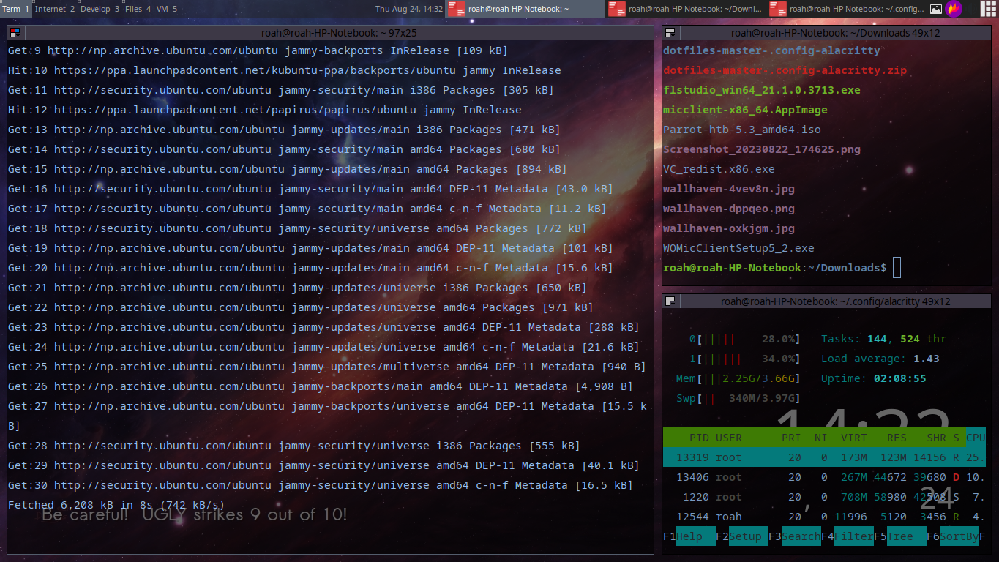
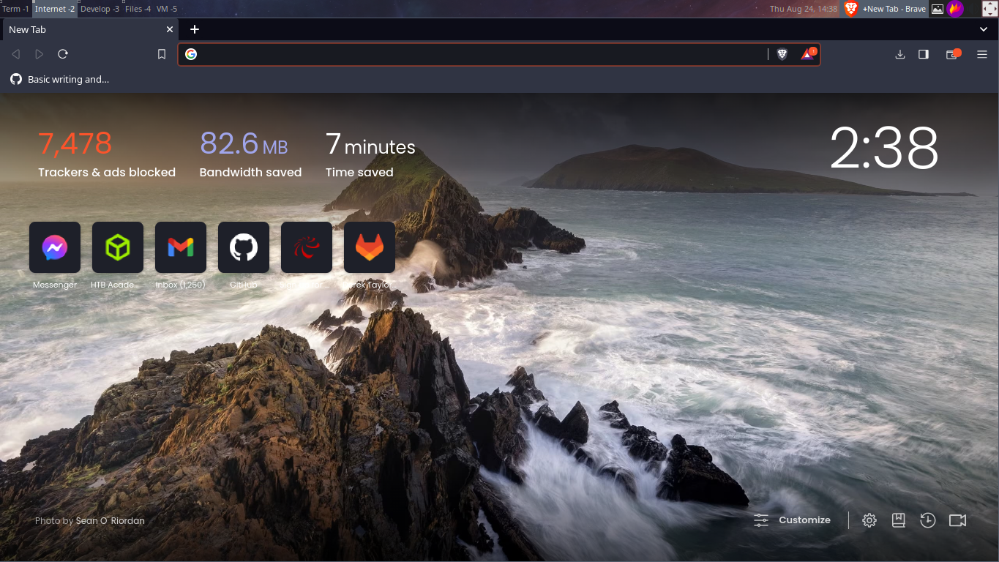
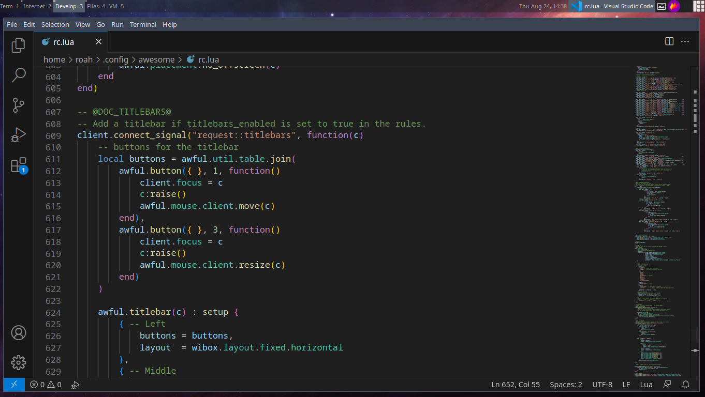
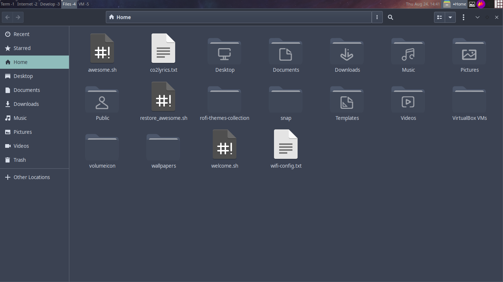
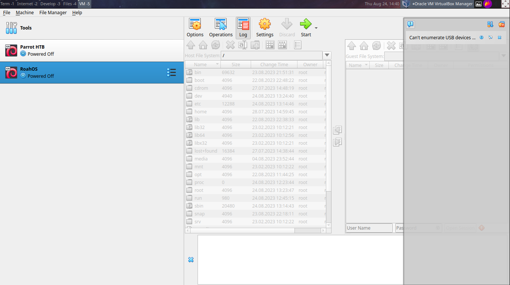

# Awesome

## This is a Theme/Cofiguration for awesome wm for easy usage and minimal overall system for debian or debian based distros such as ubuntu

## Features:
-Work specified workspaces; different processes/widows are assigned different workspaces such as Term for terminals, Internet for browsers, Develop for editors, Files for file explorer and VM for virtual machine windows.
-Very minimal and resource efficient
-Keyboard centric and saves lot of time used to reach for a mouse
-Productivity and efficiency centric

## Screenshot:

### You can access the shortcuts/hotkeys by pressing Mod + s /n
Here, Mod stands for windows key or super key.

## Installing dependencies:
There are some specific programs installed for efficient workflow and for ease of use you should install them via the command:
`./awesome/programs.sh`
for this command to work you need to be on the same directory as the downloaded folder ie awesome

## Installing awesome:
You can install awesome by inserting the followning command in the terminal:
`sudo apt-get install awesome or
sudo apt install awesome`

## Configuring awesome:
Again open the directory where you downloaded the 'awesome' folder and enter the following command
`sudo mkdir ~/.config/awesome/ 
cp awesome/rc.lua ~/.config/awesome/rc.lua`

## Booting into awesome wm:
Now, you should be all ready to boot into your new workflow. Logout from your current DE and search for a session setting in the login screen and select awesome. Now enter your password and enter you will be greated with awesome wm.
You can set the wallpaper from the top right picture icon.
and all the shortcuts and hotkeys can be accessed by pressing '`Mod + s`'
And also always remember '`Mod + Enter`' opens terminal.

